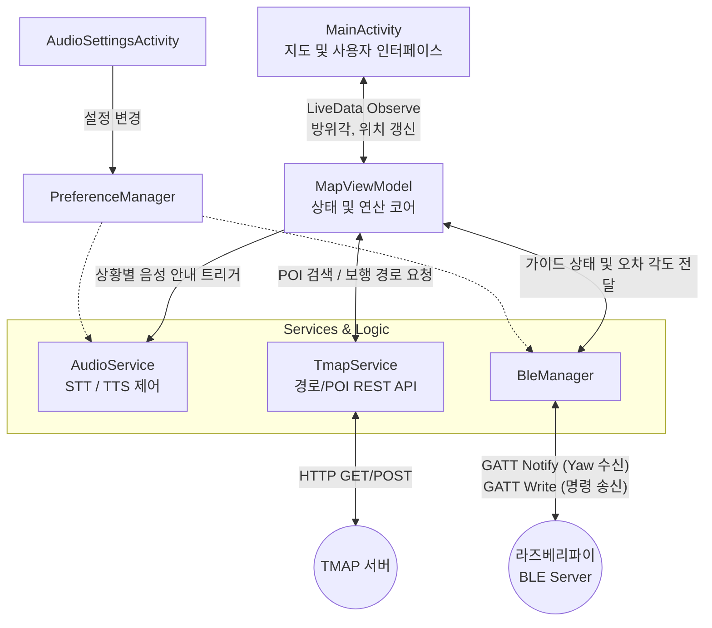

# 📱 VIP-Wearable - Android App (Navigation & BLE Client)
시각장애인 보행 보조 시스템의 사용자 인터페이스 및 내비게이션 역할을 수행하는 안드로이드 애플리케이션입니다.<br>
TMAP REST API를 활용하여 최적의 보행 경로를 탐색하고, 라즈베리파이기반의 AI 서버와 BLE(GATT) 통신으로 실시간 경로 오차 각도와 시스템 제어 상태를 연결합니다.

## 🛠 기술 스택
* **Language:** Java 11
* **Architecture:** MVVM (Model-View-ViewModel)
* **Navigation & Map:** TMAP SDK (`TMapView`), LocationManager (GPS/Network)
* **Connectivity:** Android BLE API (`BluetoothGatt`, `BluetoothLeScanner`)
* **Voice I/O:** Android `TextToSpeech` (TTS), `SpeechRecognizer` (STT)

## 💡 주요 구현 기능
**1. TMAP 기반 도보 내비게이션 및 UI 렌더링**
* TMAP 보행자 경로 API를 호출하고, 반환된 JSON 데이터를 파싱하여 시설물 타입(보도, 횡단보도 등)에 따라 다채로운 색상의 경로 생성
* 생성된 경로는 `TMapView` 위에 `TMapPolyLine`으로 시각화되며, 사용자의 현재 위치와 방위각에 맞춰 커스텀 마커가 회전하며 실시간 트래킹을 제공

**2. 고신뢰성 BLE GATT 클라이언트 통신 (`BleManager`)**
* **MTU 확장 및 안정성:** 연결 직후 MTU 크기를 256 바이트로 확장하여 패킷 전송 효율을 높이고, 안드로이드 통신 파라미터가 안정화될 때까지 1.5초 대기 후 통신을 시작하는 안정성 보장 로직 구현
* **200ms 주기 고속 제어:** 안내가 시작되면 자체 Scheduled Thread를 가동하여 200ms마다 경로 오차 각도(`0x22` 헤더)를 라즈베리파이로 전송

**3. 음성 기반 무장애 인터페이스 (`AudioService`)**
* `SpeechRecognizer`를 통해 사용자의 음성으로 목적지를 검색하고, `TextToSpeech` 엔진을 통해 경로 이탈, 방향 회전, 목적지 도착 등의 내비게이션 메시지를 음성으로 안내
* 사용자의 취향에 맞게 음성 안내 속도(Rate), 음정(Pitch), 시스템 볼륨을 세밀하게 조절하고 저장 가능

## 🏗 시스템 아키텍처



## 📂 폴더 구조

```text
📦 app/src/main/java/com/example/vip_wearable_java
 ┣ 📂 config
 ┃ ┗ 📜 AppConfig.java           # 하이퍼파라미터 및 오디오/위치 기본 상수 정의
 ┣ 📂 models
 ┃ ┗ 📜 RouteSegment.java        # TMAP 경로 구간 데이터 및 색상 모델
 ┣ 📂 services
 ┃ ┣ 📜 AudioService.java        # TTS/STT 초기화 및 시스템 볼륨 동기화 매니저
 ┃ ┣ 📜 BleManager.java          # BLE 스캔, GATT 연결, MTU 협상, 데이터 송수신 스레드
 ┃ ┗ 📜 TmapService.java         # OkHttp 기반 TMAP POI 및 보행자 경로 API 비동기 통신
 ┣ 📂 utils
 ┃ ┗ 📜 PreferenceManager.java   # 기기 MAC 주소 및 오디오 설정값 영구 저장 유틸
 ┣ 📂 viewmodels
 ┃ ┗ 📜 MapViewModel.java        # 목적지 방위각 연산 및 UI/BLE 상태 동기화
 ┣ 📜 AudioSettingsActivity.java # 오디오 설정 및 BLE 연결 초기화 화면
 ┗ 📜 MainActivity.java          # TMapView 렌더링, 위치 리스너, 주요 이벤트 컨트롤러
```

## 📍 통신 및 인터페이스 구성

### 📡 RPi 연동망 (BLE GATT Client)
라즈베리파이(VIP_Guide) 기기와 매칭되는 GATT 서비스 및 특성(Characteristic) 통신 규격입니다.
| UUID          | 특성 속성              | 설명 및 패킷 구조                                                                                                                          |
| ------------- | ---------------------- | ------------------------------------------------------------------------------------------------------------------------------------------ |
| `0000ffe0...` | Service                | 메인 통신 서비스 (SERVICE_UUID)                                                                                                            |
| `0000ffe1...` | Notify (RX)            | **센서 방위각(Yaw) 수신 채널** <br> 패킷: `[0x11, Data(4-byte Float)]`                                                           |
| `0000ffe2...` | Write No Response (TX) | **상태 제어 및 오차 각도 송신 채널** <br> 제어 패킷: `[0x33, State(1-byte)]` <br> 가이드 패킷: `[0x22, ErrorData(4-byte Float)]` |

## 🚀 시스템 동작 흐름 (State Flow)
### 1. **초기화 및 기기 탐색**
앱 실행 시 위치, 블루투스, 마이크 권한을 확인합니다. 이후 이전에 연결된 기기 MAC 주소가 있다면 자동 연결을 시도하고, 없다면 BLE 스캔 다이얼로그를 띄워 `VIP_Wearable` 기기를 찾아 연결합니다.

### 2. **연결 수립 및 대기 (State `0x01`)**
GATT 연결 완료 후 MTU를 256으로 확장하고, Notify 채널을 엽니다. 초기 상태에서는 AI 자원 절약을 위해 대기 모드(`0x33, 0x01`) 플래그를 라즈베리파이로 전송합니다.

### 3. **목적지 검색 및 경로 획득** 
사용자가 마이크 버튼을 눌러 음성으로 목적지를 말하면, `TmapService`가 POI를 검색하고 확정 시 경로 위경도 리스트를 획득합니다.

### 4. **가이드 시작 (State `0x02`)** 
안내가 개시되면 `BleManager`를 통해 구동 플래그(`0x33, 0x02`)를 전송하여 카메라 비전 AI를 깨웁니다.

### 5. **실시간 트래킹 및 제어 루프** 
  * 수신되는 GPS 좌표와 BLE 방위각(Yaw)을 조합하여 현재 진행해야 할 최적 방향(Bearing)과의 오차 각도를 지속적으로 연산합니다.
  * `BleManager` 내부의 스케줄러 스레드가 200ms 단위로 오차 각도를 라즈베리파이에 전송(`0x22` 패킷)하여 하드웨어 햅틱 제어를 지시합니다.
  
### 6. **종료 (State `0x00` / `0x01`)** 
목적지 도착 시 가이드 스레드를 중지하고 대기 모드(`0x33, 0x01`)로 복귀하며, 앱에서 연결 끊기 버튼을 누르면 단절 플래그(`0x33, 0x00`) 전송 후 GATT를 종료합니다.

---

## 🚀 시작하기 (Getting Started)

### 1. API 키 설정 (필수)
프로젝트 실행을 위해서는 발급받은 TMAP API 키가 필요합니다. `local.properties` (또는 `BuildConfig` 연동) 환경에 맞추어 아래 키가 주입되어야 합니다.
```properties
TMAP_API_KEY="발급받은_TMAP_APP_KEY"
```

### 2. 권한 허용
앱 최초 실행 시 다이얼로그로 팝업되는 다음 세 가지 권한을 반드시 모두 허용해야 정상 동작합니다.
* **위치 (정확한 위치):** GPS 기반 경로 추적
* **근처 기기 (블루투스):** 라즈베리파이 가이드 장치 탐색 및 통신
* **마이크:** 목적지 음성(STT) 검색 기능 지원

### 3. 디바이스 페어링 및 설정
* 앱 우측 상단의 **'블루투스 스캔'** 아이콘을 눌러 전원이 켜진 라즈베리파이(`VIP_Wearable`)와 연결합니다. 연결이 완료되면 하단 바가 초록색으로 변경됩니다.
* 우측 하단의 톱니바퀴 아이콘을 눌러 오디오 설정 화면에 진입하면 음성 안내의 속도와 볼륨을 조정할 수 있습니다.