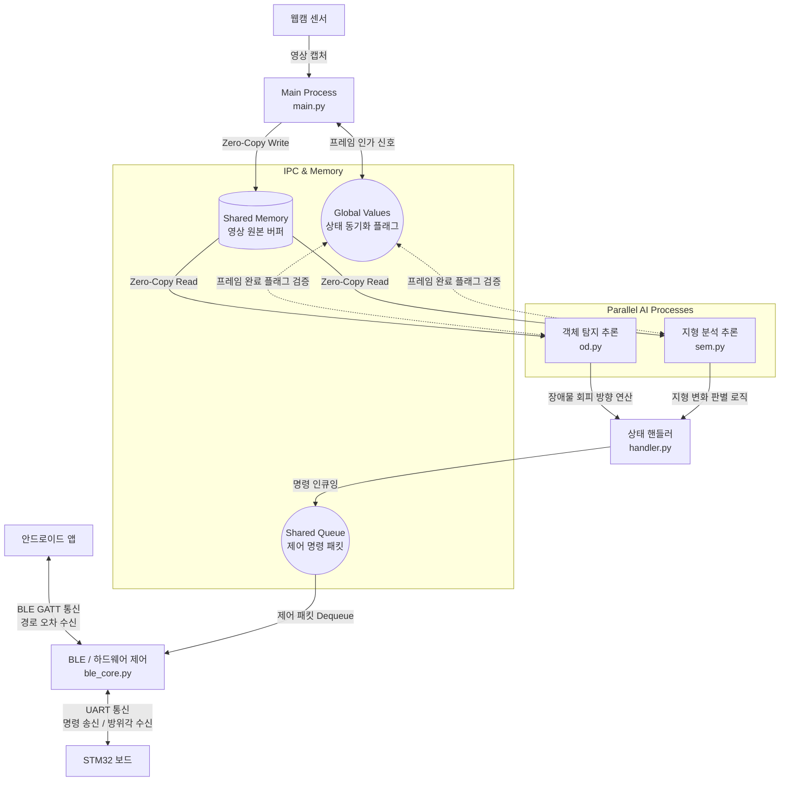

# 🍓 VIP-Wearable - RaspberryPi (Vision AI & BLE Server)
라즈베리파이 5 기반의 보행 보조 자율주행 AI 및 멀티프로세싱 통신 서버 파트입니다.<br>카메라를 통해 수집된 영상으로 실시간 장애물 회피 및 지형 인식 AI를 구동하며, 스마트폰 앱(BLE)과 STM32 제어 보드(UART) 사이를 잇는 시스템의 중추 역할을 담당합니다.

## 🛠 기술 스택
* **Board:** Raspberry Pi 5 (4GB)
* **OS:** Raspberry Pi OS (64-bit)
* **Language:** Python 3.11+
* **AI & Vision:** OpenCV, PyTorch, Ultralytics (YOLO26n / best_int8_freeze5.onnx(YOLO26n-sem Fine tuning)), ONNXRuntime
* **Connectivity:** Bluetooth Low Energy (BlueZ / D-Bus), PySerial
* **Concurrency:** Multiprocessing (Shared Memory, Queue, Value)

## 💡 주요 구현 기능
### **1. 공유 메모리(Shared Memory) 기반 제로카피 아키텍처**
* **프레임 복사 오버헤드 제거:** 카메라 캡처 영상을 `multiprocessing.shared_memory` 호스트 버퍼에 다이렉트 바인딩하여 메모리 병목 현상 해결
* **프로세스 간 상태 동기화:** 독립된 서브 프로세스(OD, SEM, BLE) 간의 제어 흐름을 `multiprocessing.Value` 플래그 및 `Queue`를 통해 스레드 세이프 관리

### **2. 듀얼 Vision AI 추론 모델 병렬 구동**
* **정적 장애물 회피 (OD):** 양자화된 모델(`yolo26n.onnx`)을 통해 전방의 볼라드(0), 사람(1), 킥보드(2)를 실시간으로 탐지하고, 1차원 위험 지도를 산출하여 3방향(좌/우/중앙) 회피 알고리즘 수행
* **지형 분석 세그멘테이션 (SEM):** yolo26n-sem모델을 파인튜닝 하여 차도(0), 보도블록(1), 횡단보도(2) 영역을 픽셀 단위로 분할 인식(`best_int8_freeze5.onnx`)
* **상태 필터링 & 자원 최적화:** AI의 순간적인 인식 오류를 막기 위해 큐 기반의 `CurrentLocationStatus` 필터를 거쳐 지형 상태를 확정하며, ONNX Runtime 그래프 최적화 및 프로세스별 단일 스레드 할당으로 코어 자원을 효율적으로 분배

### **3. 고신뢰성 BLE GATT 서버 및 UART 하드웨어 통합**
* **D-Bus 기반 BLE 인프라:** BlueZ 프로토콜을 활용해 안드로이드 앱과 무선망을 구축하여 경로 오차 보정 각도를 실시간으로 수신
* **ST 보드 직렬 제어:** 수신된 앱 경로 데이터와 자체 AI 연산 결과를 패킷화하여 하드웨어 시리얼 포트(`ttyAMA0`)를 통해 STM32 햅틱 제어부로 115200bps 속도로 전송

### **4. 리눅스 커널 레벨 시스템 튜닝**
* **BLE 단절 원천 차단:** `/boot/firmware/config.txt`에 `pcie_aspm=off` 옵션을 적용해 라즈베리파이 고유의 절전 모드를 해제하고, `ConnSupvTimeout` 마진을 15초로 늘려 통신 신뢰성을 극대화했습니다.
* **포트 권한 독점:** 하드웨어 시리얼 통신을 위해 리눅스의 기본 시리얼 콘솔 로그인(`serial-getty`) 데몬을 완전히 비활성화시켰습니다.

## 🏗 시스템 아키텍처



## 📂 폴더 구조
프로젝트는 코어 병렬 처리를 위해 프로세스 단위로 모듈화되어 있습니다.

```text
📦 vip_wearable_rasi
 ┣ 📜 main.py                  # 중앙 컨트롤러 (카메라 캡처, 프로세스 스폰, 공유메모리 관리)
 ┣ 📜 od.py                    # Object Detection 서브 프로세스 (장애물 탐지)
 ┣ 📜 sem.py                   # Semantic Segmentation 서브 프로세스 (지형 분석)
 ┣ 📜 utils.py                 # 위험도 계산, ROI 설정, FPS, 마스크 시각화 유틸리티
 ┣ 📂 basic                    # 시스템 핵심 설정 및 동기화 인프라
 │  ┣ 📜 config.py              # 시스템 파라미터, BLE UUID, 카메라 해상도 설정
 │  ┣ 📜 g_val.py               # 멀티프로세싱 Value 동기화 전역 플래그 모음
 │  ┣ 📜 handler.py             # 제어 명령 및 이벤트 큐잉 핸들러
 │  ┗ 📜 ble_core.py            # BLE GATT 서버 구동 및 STM32 UART 통신 메인 루프
 ┗ 📂 models
    ┗ 📂 Quantization_models     # INT8 양자화가 적용된 초경량 ONNX 모델 폴더
       ┣ 📜 yolo26n.onnx
       ┗ 📜 best_int8_freeze5.onnx
```

## 📍 통신 및 인터페이스 구성

### 🔗 하드웨어 통신망 (UART & GPIO)
* **UART 인터페이스:** `/dev/ttyAMA0` (GPIO 14 TX, GPIO 15 RX)
* **통신 속도 (Baudrate):** 115200 bps

### 📡 모바일 앱 연동망 (BLE GATT Service)
| UUID                                   | 설명                                                           | 속성                   |
| -------------------------------------- | -------------------------------------------------------------- | ---------------------- |
| `0000ffe0-0000-1000-8000-00805f9b34fb` | 메인 트래커 서비스 (TrackerGattService)                        | Service                |
| `0000ffe1-0000-1000-8000-00805f9b34fb` | STM32에서 수집된 방위각(Yaw) 데이터 앱으로 스트리밍            | Notify                 |
| `0000ffe2-0000-1000-8000-00805f9b34fb` | 스마트폰 앱에서 연산된 경로 오차 각도 및 상태 제어 플래그 수신 | Write Without Response |

## 🚀 시스템 동작 흐름 (State Flow)
### 1. **초기화 및 대기** 
`main.py` 구동 시 서브 프로세스(OD, SEM, BLE) 생성 및 카메라가 할당되며, 시스템은 BLE 연결 대기 상태(Sleep)로 돌입하여 AI 자원 소모를 차단합니다.
### 2. **앱 상태 수신 (`0x33` 패킷)** 
앱에서 BLE GATT를 통해 상태 제어 플래그를 전달합니다.
   * **Sleep (`0x00`):** 사용자 앱 연결 종료 시 동작하며, AI 추론을 멈추고 STM32 보드로 대기 모드 진입 플래그를 전송합니다.
   * **Wake (`0x01`):** 내비게이션 시작 시 동작하며, 시스템을 활성화하고 STM32로 구동 플래그를 전송합니다.
### 3. **가이드 구동 시작** 
   * 앱 오차 각도(`0x22` 패킷)를 실시간 수신합니다.
   * 카메라 프레임이 공유 메모리에 바인딩되며 AI 추론이 개시됩니다.
   * 탐지된 장애물/지형 데이터가 `Shared Queue`를 거쳐 BLE 프로세스로 전달됩니다.
### 4. **제어 명령 융합 및 전송** 
큐에 쌓인 데이터와 오차 각도를 조합하여 `0xAA` 헤더와 함께 UART 포트로 STM32에 햅틱 피드백 명령을 전송합니다.

## 🚀 시작하기 (Getting Started)

### 1. 시스템 환경 및 하드웨어 구성
라즈베리파이 5의 UART 포트 점유, 커널 절전 모드 비활성화(`pcie_aspm=off`), BlueZ 데몬 설정 및 포트 권한 부여 작업이 선행되어야 합니다. 
자세한 시스템 아키텍처 세팅 및 리눅스 명령어는 `doc/라즈베리파이 설정 관련 파일.txt` 가이드 문서를 참고하여 해당 환견에 맞게 진행해 주세요.

### 2. 파이썬 의존성 패키지 설치
YOLO26n INT8 추론, 멀티프로세싱, BLE/UART 제어 등 프로젝트 구동에 필요한 전체 라이브러리를 `doc` 폴더의 의존성 명세서를 통해 한 번에 설치합니다.

```bash
pip3 install -r doc/requirements.txt
```

### 3. 프로젝트 실행
하드웨어(UART 직렬 포트, BLE 어댑터) 및 공유 메모리에 직접 접근해야 하므로 권한 설정을 해주거나 반드시 `sudo` 권한으로 메인 컨트롤러를 실행해야 합니다.

```bash
cd vip_wearable_rasi
sudo python3 main.py
```

---

## 💻 터미널 실행 로그 예시 (Execution Example)
명령어를 실행하면 멀티프로세스가 스폰되며 아래와 같은 초기화 로그가 출력되고 **BLE 연결 대기 상태(Sleep)** 로 진입합니다.

```text
[main.py] 보행 보조 시스템 중앙 컨트롤러 가동...
[main.py] 자식 AI 엔진 및 통신 서버 병렬 프로세스 생성 중...
[od.py] 정적 객체 3방향 회피 AI 엔진 가동 (모듈화 완료)...
[sem.py] 시맨틱 세그멘테이션 AI 엔진 가동...
[ble_core.py] D-Bus 메시지 버스 및 프록시 객체 바인딩 중...
[시스템] GATT 서버 서비스 스펙트럼 인스턴스 초기화 완료.
[하드웨어] STM32용 UART 채널 바인딩 (/dev/ttyAMA0, 115200bps)
[ble_core.py] BLE 광고 송출 성공 (기기 이름: VIP_Guide)
==================================================
라즈베리파이 고속 BLE 가이드 서버
==================================================
[ble_core.py] AI 제어 명령 수신 태스크 가동 완료.
[main.py] AI 프로세스 및 BLE 서버 정상 가동 완료.
[main.py] 웹캠 연결 완료. BLE 연결을 대기합니다... (AI 연산 휴면 상태)
------------------------------------------------------------
```

이후 스마트폰 앱에서 **'VIP_Wearble'** 기기와 연결을 맺고 목적지를 입력해 내비게이션을 시작하면, 즉시 자원 휴면 상태가 해제(Wake)되며 아래와 같이 실시간 가이드 로그가 스트리밍됩니다.

```text
==================================================
[ble_core.py] 📱앱 명령: 연결됨/경로취소 (AI ON, 대기 중)
==================================================
[ble_core.py] ST 보드로 구동(Wake) 명령 플래그 전송 완료.
[ble_core.py] 📱앱 명령: 목적지 입력! (내비게이션 시작)
[지형 안내 - SEM] 전방에 [보도블록] 진입합니다.
[ble_core.py] 수신: 앱 경로 오차: 15.2° -> 오른쪽 보정          
[경로 보정 - SEM] 보행 경로가 오른쪽으로 이탈했습니다.
[정적 장애물 회피 - OD] 전방에 정적 장애물 감지! 왼쪽으로 회피하세요.
[ble_core.py] 송신: STM32 방위각(Yaw) 전송 중: 45.30°
```

## 👥 멤버 및 역할
### **이정훈** (Main Embedded & S/W Architect)
  * Edge AI 소프트웨어 아키텍처 설계 및 핵심 시스템 구축
  * 서비스 목적에 맞춘 경량 인공지능 모델(YOLO 커스텀 모델) 파인 튜닝
  * 라즈베리파이 기반 멀티프로세싱 및 공유 메모리(Zero-copy) 아키텍처 설계
  * `main.py` 고속 카메라 캡처, 다중 자식 AI 프로세스 동기화 및 프레임 분배 파이프라인 구현 (단일 프로세스 대비 처리 속도 2배 향상: Avg 6 FPS ➔ 12 FPS)
  * `sem.py` 및 `od.py` 추론 프로세스, FPS 최적화, 관심 영역(ROI) 알고리즘 통합 설계
  * UART 통신 인터페이스 및 비동기 이벤트 제어 상태 핸들러(`handler.py`) 설계
### **이명욱** (Connectivity & Hardware Integration Engineer)
  * 라즈베리파이5의 고속 BLE 인터페이스 및 STM32 UART 통신 연동 파이프라인 개발
  * `bluez-peripheral` 라이브러리를 활용해 라즈베리파이를 블루투스(BLE) 서버로 구축하고, 스마트폰 앱과 데이터를 주고받기 위한 전용 통신 채널 설계
  * 스마트폰 앱 명령 프로토콜 설계 및 상태 제어 플래그(Sleep: 0x00, Wake: 0x01) 제어 흐름 구축
  * `pySerial`을 활용한 STM32 고속 패킷 직렬 통신(115200bps) 구현 및 방위각(Yaw) / 기울기(Pitch) 파싱 로직 최적화
  * 메인 제어 루프의 비동기 태스크 스케줄링(`asyncio.gather`)을 통한 센서 스트리밍 데이터와 AI 조향 신호의 병목 없는 전송망 구축