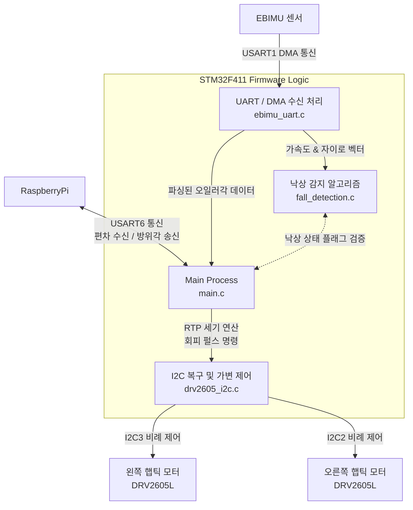

# 🕹️ VIP-Wearable - ST (Embedded) 
STM32F4 기반의 보행 보조 및 낙상 감지를 위한 펌웨어 파트입니다.<br>IMU 센서를 통해 사용자의 움직임을 실시간으로 모니터링하고, 라즈베리파이와의 통신을 통해 좌우 햅틱 모터를 제어하여 사용자에게 방향을 안내합니다.

## 🛠 기술 스택
* **MCU (Board):** NUCLEO-F411RE (STM32F411RET6)
* **Framework:** HAL Library, Bare-metal (No RTOS)
* **IDE:** STM32CubeIDE 1.19.0
* **Language:** C
* **Sensors & Actuators:** 
  * EBIMU-9DOFV5-R3 (가속도, 자이로, 오일러 각도 수집)
  * Grove - Haptic Motor(DRV2605L) x 2 (좌/우 ERM 모터 제어)

## 💡 주요 구현 기능
**1. 고신뢰성 센서 통신 및 I2C 자동 복구**
* **DMA 기반 파싱:** EBIMU의 데이터를 DMA로 수신하고, 패킷 헤더(`0x55`, `0x55`) 및 체크섬을 파싱하여 시스템 부하를 최소화
* **I2C 버스 복구(Recovery):** 햅틱 모터 제어 중 I2C 통신 단절 감지 시, GPIO 강제 토글을 통해 버스를 릴리즈하고 하드웨어를 초기화하여 동작을 재개하는 복구 알고리즘 구현

**2. 실시간 낙상 감지 (Fall Detection)**
* 주기마다 가속도 및 자이로 센서의 벡터 합산 크기(SVM, GVM)를 계산하여 사용자의 상태를 추적
* `자유낙하(무중력) ➔ 충격량(High Threshold) ➔ 최종 정지`로 이어지는 3단계 상태 머신을 적용하여 일상 동작과 실제 낙상을 구분
* 낙상이 확정되면 양쪽 햅틱 모터에 강력한 경보 진동을 고정 출력하여 비상 상황 알림

**3. RTP(Real-Time Playback) 기반 가변 햅틱 제어**
* 라즈베리파이에서 수신된 경로 편차값(-100 ~ 100)을 기반으로 좌우 모터의 세기를 실시간으로 비례 제어
* 편차가 클수록 목표 방향의 모터 진동 세기가 강해지며, 목표 궤적에 들어오면 진동 완화

## 🏗 시스템 아키텍처


## 📂 폴더 구조
프로젝트의 핵심 로직은 `Core` 폴더 내에 모듈화되어 있습니다.

```text
📦 vip_wearable_st
 ┣ 📂 Core
 │  ┣ 📂 Inc                 # 헤더 파일 (.h)
 │  │  ┣ 📜 drv2605_i2c.h     # 햅틱 모터 제어 및 I2C 복구 헤더
 │  │  ┣ 📜 ebimu_uart.h      # IMU 센서 데이터 파싱 헤더
 │  │  ┣ 📜 fall_detection.h  # 낙상 감지 알고리즘 헤더
 │  │  ┗ 📜 main.h            # 시스템 메인 헤더 및 핀 맵 정의
 │  ┣ 📂 Src                 # 소스 파일 (.c)
 │  │  ┣ 📜 drv2605_i2c.c     # 햅틱 모터 제어 및 I2C 복구 로직
 │  │  ┣ 📜 ebimu_uart.c      # IMU 센서 데이터 파싱
 │  │  ┣ 📜 fall_detection.c  # 낙상 감지 상태 머신 구현부
 │  │  ┗ 📜 main.c            # 메인 실행 루프 및 UART 통신 제어
 ┗ 📜 README.md              # ST 프로젝트 명세서
 ```

 ## 📍 핀 맵 (Pin Configuration)
| 핀 번호        | 기능 (Label)                | 통신 방식 | 연결 모듈 / 용도                          |
| -------------- | --------------------------- | --------- | ----------------------------------------- |
| `PA9` / `PA10` | IMU_TX / IMU_RX             | USART1    | EBIMU 센서 데이터 수신          |
| `PA8` / `PC9`  | Haptic_L_SCL / Haptic_L_SDA | I2C3      | 왼쪽 DRV2605L 햅틱 모터 제어     |
| `PB10` / `PB9` | Haptic_R_SCL / Haptic_R_SDA | I2C2      | 오른쪽 DRV2605L 햅틱 모터 제어   |
| `PC6` / `PC7`  | RASI_TX / RASI_RX           | USART6    | 라즈베리파이와의 통신            |
| `PA2` / `PA3`  | COM_TX / COM_RX             | USART2    | PC 디버깅(printf) 시리얼 출력 |


## 📡 라즈베리파이와의 통신 프로토콜 (UART6)
라즈베리파이와는 양방향 비동기 시리얼 통신을 통해 데이터와 제어 플래그를 교환합니다.

### 📥 수신 (Raspberry Pi ➔ ST) : 총 7바이트 크기
| 바이트  | 데이터            | 타입      | 설명                                                                       |
| ------- | ----------------- | --------- | -------------------------------------------------------------------------- |
| `[0]`   | `Header`          | `uint8_t` | 패킷 시작을 알리는 고정 검증 헤더 (`0xAA`)                        |
| `[1~4]` | `app_angle_error` | `float`   | 실제 경로와 목표 경로 간의 편차 각도 (Big Endian)                 |
| `[5]`   | `cmd_flag`        | `uint8_t` | `0x01`: 구동 모드 작동, `0x00`: 대기 모드 (모터 차단)             |
| `[6]`   | `fb_flag`         | `uint8_t` | `0x00`: 일반 주행 진동, `0x01`: 장애물 회피 펄스 진동(250ms 토글) |

### 📤 송신 (ST ➔ Raspberry Pi) : 100ms 주기, 총 9바이트 크기
| 바이트  | 데이터   | 타입      | 설명                                               |
| ------- | -------- | --------- | -------------------------------------------------- |
| `[0]`   | `Header` | `uint8_t` | 패킷 시작 고정 헤더 (`0xAA`)              |
| `[1~4]` | `Yaw`    | `float`   | IMU에서 수집된 현재 방위각 (단위: °)      |
| `[5~8]` | `Pitch`  | `float`   | IMU에서 수집된 현재 상하 기울기 (단위: °) |

## 🚀 시스템 동작 흐름 (State Flow)
1. 전원 인가 시 주변기기 초기화 및 센서 연결 시도 (연결 실패 시 재시도 로직 동작)
2. UART6 인터럽트로 수신되는 `cmd_flag` 확인
   * **대기 모드 (`cmd_flag = 0`):** 모든 햅틱 피드백을 차단하고 500ms 주기로 대기하며 시스템 대기.
   * **구동 모드 (`cmd_flag = 1`):**
     * 라즈베리파이로부터 100ms 마다 수집된 센서값(Yaw, Pitch) 전송
     * `fb_flag`가 `1`(회피)일 경우 250ms 단위로 모터를 점멸(Toggle)하여 긴급성을 알림
     * `fb_flag`가 `0`(일반)일 경우 편차에 맞추어 50ms마다 부드러운 가변 햅틱 업데이트
     * 상시 낙상 감지(Fall Detection) 알고리즘 병행 수행